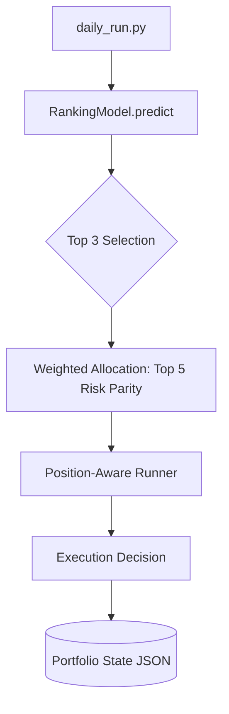

# Paper Trading (Shadow Execution) Teknik Dokümantasyonu

Bu dokümantasyon, BIST30 AI Trader projesindeki Paper Trading altyapısının teknik detaylarını açıklar.

---

## 📐 Mimari Genel Bakış



---

## 🗂️ Dosya Yapısı

| Dosya | Rol | Bağımlılıklar |
|-------|-----|---------------|
| `run_paper.py` | Orchestrator - Günlük çalıştırılan ana script | `daily_run`, `PaperEngine` |
| `core/paper_engine.py` | Shadow Execution mantığı | `PaperLogger` |
| `core/paper_logger.py` | JSON Lines formatında loglama | - |
| `analyze_paper.py` | Log analizi ve raporlama | `PaperLogger`, `DataLoader` |

---

## 🔧 Modül Detayları

### 1. `core/paper_logger.py`

**Amaç:** Yapılandırılmış JSON loglama.

```python
class PaperLogger:
    def __init__(self, log_dir="logs/paper_trading")
    def log_decision(self, snapshot: dict) -> None
    def load_logs(self, start_date=None, end_date=None) -> pd.DataFrame
```

**Log Formatı:** JSON Lines (`.jsonl` benzeri `.json`)
```json
{"timestamp": "2024-02-01T10:00:00", "ticker": "ASELS.IS", "action": "BUY", ...}
{"timestamp": "2024-02-01T10:01:00", "ticker": "GARAN.IS", "action": "WAIT", ...}
```

**Dosya Adlandırma:** `paper_trades_YYYY-MM-DD.json`

---

### 2. `core/paper_engine.py`

**Amaç:** Sinyalleri alıp "sanal emir" (Shadow Order) oluşturur.

```python
class PaperEngine:
    def __init__(self)
    def execute_snapshot(self, snapshot: dict) -> dict
```

**Execution Logic (Aggressive):**
```
1. Signal == 'WAIT' → action = 'HOLD' (If exists)
2. ENABLE_MACRO_GATE == False (veya Gevşek Eşikler) → Direct execution
3. Confidence < 0.50 → Signal ignored (Eşik düşürüldü)
4. Otherwise → Target weight allocation based on Top 5 logic
```

**Çıktı Dictionary:**
```python
{
    # Orijinal Snapshot alanları
    'ticker': str,
    'action': str,           # BUY / SELL / WAIT
    'confidence': float,
    'regime': str,
    'current_price': float,
    'macro_blocked': bool,
    
    # Execution sonucu
    'executed': bool,
    'blocked_reason': str | None,
    'simulated_price': float,
    'simulated_quantity': float,
    'execution_time': str    # ISO format
}
```

---

### 3. `daily_run.get_signal_snapshots()`

**Amaç:** Sinyal üretim pipeline'ını dışarıdan çağrılabilir hale getirir.

```python
def get_signal_snapshots(verbose=True) -> List[dict]
```

**Snapshot İçeriği:**
| Alan | Tip | Kaynak |
|------|-----|--------|
| `ticker` | str | Loop variable |
| `timestamp` | str | `datetime.now().isoformat()` |
| `macro_blocked`| bool | Macro Gate check (current config: Disabled) |
| `action` | str | Ranking prediction result |
| `confidence` | float | Model probability / score |
| `rank` | int | Sorted position in BIST30 |
| `weight` | float | Strategic target (Risk Parity or Rank Based) |

---

### 4. `analyze_paper.py`

**Amaç:** Biriken logları analiz eder.

**Temel Fonksiyonlar:**
```python
def calculate_forward_return(ticker, trade_date, holding_days=5) -> float | None
def calculate_shadow_metrics(executed_df) -> dict
def analyze_paper_performance(calculate_pnl=False) -> None
```

**CLI Kullanımı:**
```bash
# Temel rapor (hızlı)
python analyze_paper.py

# Forward Return dahil (yavaş - veri indirme gerektirir)
python analyze_paper.py --pnl
```

**Rapor Bölümleri:**
1. Genel Durum (Executed / Blocked oranları)
2. Blokaj Analizi (Neden bloke edildi?)
3. Rejim Bazlı Dağılım (Trend_Up / Sideways / Crash_Bear)
4. Sessiz Gün Analizi (Hiç işlem yapılmayan günler)
5. Forward Return (Opsiyonel - `--pnl` flag)

---

## 🔄 Veri Akışı

```
┌─────────────────────────────────────────────────────────────┐
│                      run_paper.py                           │
├─────────────────────────────────────────────────────────────┤
│ 1. get_signal_snapshots(verbose=True) çağrılır             │
│    └─> Model sinyalleri, Macro Gate durumu döner           │
│                                                             │
│ 2. Her snapshot için PaperEngine.execute_snapshot()        │
│    └─> executed / blocked kararı verilir                   │
│    └─> PaperLogger.log_decision() ile JSON'a yazılır       │
│                                                             │
│ 3. Oturum özeti konsola basılır                            │
└─────────────────────────────────────────────────────────────┘
```

---

## 🧪 Test Senaryoları

### Birim Testi (Mock)
```python
from core.paper_engine import PaperEngine

engine = PaperEngine()
result = engine.execute_snapshot({
    'ticker': 'TEST',
    'action': 'BUY',
    'confidence': 0.85,
    'macro_blocked': False,
    'size': 100
})
assert result['executed'] == True
```

### Macro Gate Blokaj Testi
```python
result = engine.execute_snapshot({
    'ticker': 'TEST',
    'action': 'BUY',
    'macro_blocked': True,  # <-- Blokaj
    'size': 100
})
assert result['executed'] == False
assert result['blocked_reason'] == 'MACRO_GATE_BLOCK'
```

---

## 📊 Metrik Hesaplama Formülleri

### Forward Return
```
Forward_Return = (Exit_Price - Entry_Price) / Entry_Price
```
- `Entry_Price`: Trade tarihindeki kapanış
- `Exit_Price`: Trade + N gün sonraki kapanış (varsayılan N=5)

### Shadow Sharpe Ratio
```
Sharpe = (Mean_Return / Std_Return) * sqrt(252)
```

### Max Drawdown
```
Max_DD = max(Peak - Cumulative_PnL)
```

### Win Rate
```
Win_Rate = Count(Return > 0) / Total_Trades
```

---

## ⚠️ Kısıtlamalar ve Notlar

1. **Gerçek Emir Yok:** `PaperEngine` hiçbir koşulda broker API'ye bağlanmaz.
2. **Forward Return Gecikmesi:** `--pnl` flag yfinance'dan veri çeker, yavaş olabilir.
3. **Haftalık Strateji:** Model haftalık sinyal üretir, günlük log'da aynı sinyal tekrarlanabilir.
4. **Log Boyutu:** JSON Lines formatı append-only, uzun vadede dosya boyutu artabilir.

---

## � Out of Scope (Kapsam Dışı)

Bu sistem aşağıdakileri **İÇERMEZ** ve **ASLA İÇERMEYECEKTİR**:

| Kapsam Dışı | Açıklama |
|-------------|----------|
| **Gerçek Emir Gönderme** | Broker API'ye bağlantı yok, olmayacak |
| **Broker Entegrasyonu** | IS Investment, Garanti vb. entegrasyonu yok |
| **Latency Optimization** | Milisaniye seviyesinde optimizasyon hedeflenmemiş |
| **HFT (High-Frequency Trading)** | Yüksek frekanslı işlem altyapısı yok |
| **Real-time Market Data** | Gecikmiş veri kullanılır (yfinance) |
| **Order Book Analizi** | Derinlik verisi kullanılmaz |
| **Margin / Kaldıraç** | Kaldıraçlı işlem simülasyonu yok |

> ⚠️ **Hukuki Uyarı:** Bu sistem yalnızca eğitim ve araştırma amaçlıdır. Gerçek para ile kullanım tamamen kullanıcının sorumluluğundadır.

---

## ✅ Live Readiness Checklist (Canlıya Geçiş Kriterleri)

Paper trading döneminin sonunda aşağıdaki kriterlerin karşılanması beklenir:

### Performans Kriterleri

| Kriter | Eşik Değer | Durum |
|--------|-----------|-------|
| Paper Sharpe ≥ Backtest Sharpe × 0.7 | Min 0.7x | ☐ |
| Max DD farkı ≤ %20 | Paper DD / Backtest DD ≤ 1.2 | ☐ |
| Win Rate tutarlılığı | Paper WR ≥ Backtest WR - 5% | ☐ |

### Risk Yönetimi Kriterleri

| Kriter | Beklenti | Durum |
|--------|----------|-------|
| Macro Gate katkısı pozitif | Engellenen işlemler ort. negatif getiri | ☐ |
| Worst-20-day DD kabul edilebilir | < %15 | ☐ |
| Position sizing tutarlı | Tek işlem < %5 portföy | ☐ |

### Operasyonel Kriterler

| Kriter | Beklenti | Durum |
|--------|----------|-------|
| Sessiz günler bilinçli | Oranı belirlendi ve kabul edildi | ☐ |
| Log dosyaları düzenli | Günlük log üretimi başarılı | ☐ |
| Hata oranı düşük | Sinyal üretim hatası < %5 | ☐ |

### Karar Matrisi

```
IF tüm kriterler karşılanıyor:
    → Canlıya geçiş için hazır
    
ELIF performans kriterleri karşılanıyor BUT risk kriterleri değil:
    → Risk parametrelerini ayarla, 2 hafta daha paper trading
    
ELIF operasyonel kriterler karşılanmıyor:
    → Altyapı sorunlarını çöz
    
ELSE:
    → Stratejiyi revize et, en az 1 ay daha paper trading
```

---

## 🚀 Geliştirme Önerileri

1. **Log Rotasyonu:** Aylık arşivleme mekanizması eklenebilir.
2. **Real-time Dashboard:** Streamlit veya Dash ile canlı izleme paneli.
3. **Advanced Risk Models:** Volatilite bazlı dinamik stop-loss optimizasyonu.

---

**Son Güncelleme:** 2026-02-05
**Versiyon:** 2.1
