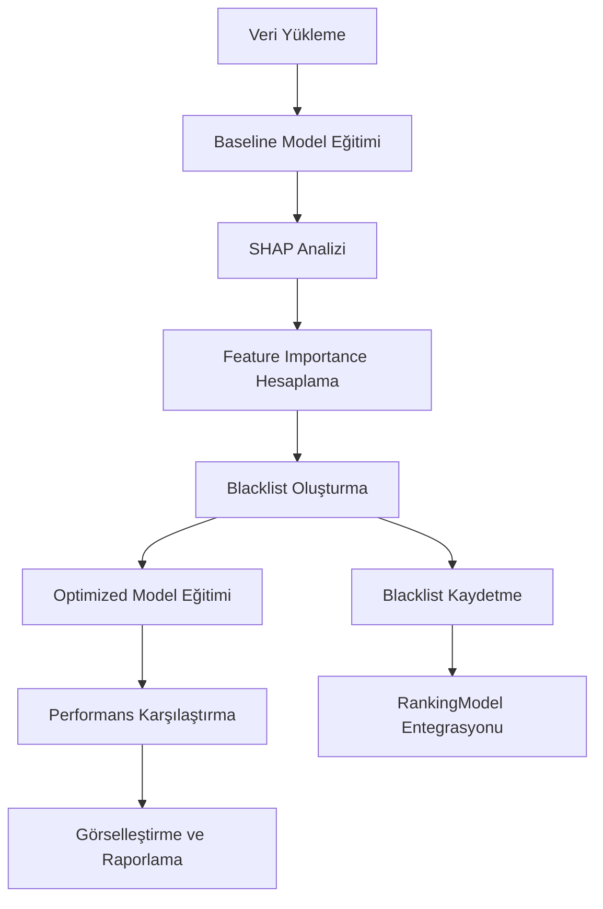

# Tasarım Dokümanı: LightGBM Feature Importance Analizi

## Genel Bakış

Bu tasarım, BIST30 AI Trader sisteminde LightGBM modelinin performansını artırmak için SHAP tabanlı feature importance analizi ve otomatik feature selection sürecini tanımlar. Sistem, mevcut `RankingModel` ve `DataLoader` altyapısını kullanarak, düşük katkılı özellikleri belirleyecek ve model eğitim pipeline'ına entegre edecektir.

### Hedefler

- NDCG@3 metriğini 0.6217'den 0.65'e yükseltmek
- Ayırt edici feature'ları (discriminative features) SHAP değerleriyle belirlemek
- Düşük katkılı feature'ları otomatik olarak filtrelemek
- Analiz sonuçlarını görselleştirmek ve raporlamak
- Feature selection'ı model eğitim sürecine otomatik entegre etmek

### Kapsam

Sistem şu bileşenleri içerecektir:
- SHAP tabanlı feature importance hesaplama modülü
- Feature selection ve blacklist yönetimi
- Baseline vs Optimized model karşılaştırma
- Görselleştirme ve raporlama
- RankingModel entegrasyonu

## Mimari

### Sistem Bileşenleri

```
┌─────────────────────────────────────────────────────────────┐
│                  Feature Importance Analyzer                 │
└─────────────────────────────────────────────────────────────┘
                              │
                ┌─────────────┼─────────────┐
                │             │             │
        ┌───────▼──────┐ ┌───▼────┐ ┌─────▼──────┐
        │ SHAP Analyzer│ │Feature │ │ Visualizer │
        │              │ │Selector│ │            │
        └──────┬───────┘ └───┬────┘ └─────┬──────┘
               │             │             │
               └─────────────┼─────────────┘
                             │
                    ┌────────▼────────┐
                    │  RankingModel   │
                    │  (LightGBM)     │
                    └─────────────────┘
```

### Veri Akışı



## Bileşenler ve Arayüzler

### 1. FeatureImportanceAnalyzer

Ana orchestrator sınıfı. Tüm analiz sürecini yönetir.

```python
class FeatureImportanceAnalyzer:
    def __init__(self, config_module, analysis_config: dict = None):
        """
        Args:
            config_module: Sistem config modülü (config.py veya sector config)
            analysis_config: Analiz parametreleri
                - sample_size: SHAP için örnekleme boyutu (default: 1000)
                - importance_threshold: Blacklist eşiği (default: 0.001)
                - start_date: Analiz başlangıç tarihi
                - end_date: Analiz bitiş tarihi
                - tickers: Analiz edilecek ticker listesi (None ise config.TICKERS)
        """
        
    def run_analysis(self) -> AnalysisResult:
        """
        Tam analiz sürecini çalıştırır.
        Returns:
            AnalysisResult: Analiz sonuçları ve metrikler
        """
        
    def _load_data(self) -> pd.DataFrame:
        """Veri yükleme ve hazırlama"""
        
    def _train_baseline_model(self, data: pd.DataFrame) -> lgb.LGBMRanker:
        """Tüm feature'larla baseline model eğitimi"""
        
    def _compute_shap_values(self, model: lgb.LGBMRanker, X: pd.DataFrame) -> np.ndarray:
        """SHAP değerlerini hesapla"""
        
    def _create_blacklist(self, shap_importance: pd.DataFrame) -> List[str]:
        """Düşük katkılı feature'ları belirle"""
        
    def _train_optimized_model(self, data: pd.DataFrame, blacklist: List[str]) -> lgb.LGBMRanker:
        """Blacklist uygulanmış model eğitimi"""
        
    def _compare_models(self, baseline_model, optimized_model, test_data) -> dict:
        """Model performanslarını karşılaştır"""
        
    def _save_results(self, results: AnalysisResult):
        """Sonuçları kaydet (blacklist, rapor, grafikler)"""
```

### 2. SHAPAnalyzer

SHAP değerlerini hesaplayan ve feature importance'ı belirleyen bileşen.

```python
class SHAPAnalyzer:
    def __init__(self, model: lgb.LGBMRanker, sample_size: int = 1000):
        """
        Args:
            model: Eğitilmiş LightGBM modeli
            sample_size: SHAP hesaplaması için örnekleme boyutu
        """
        
    def compute_importance(self, X: pd.DataFrame) -> pd.DataFrame:
        """
        SHAP değerlerini hesapla ve feature importance döndür.
        
        Args:
            X: Feature matrisi
            
        Returns:
            DataFrame: feature, importance sütunlarıyla sıralanmış tablo
        """
        
    def _handle_multiclass_output(self, shap_values) -> np.ndarray:
        """Çok sınıflı SHAP çıktılarını işle"""
```

### 3. FeatureSelector

Feature selection ve blacklist yönetimi.

```python
class FeatureSelector:
    def __init__(self, threshold: float = 0.001):
        """
        Args:
            threshold: Importance eşiği (altındakiler blacklist'e alınır)
        """
        
    def create_blacklist(self, importance_df: pd.DataFrame) -> List[str]:
        """
        Düşük katkılı feature'ları belirle.
        
        Args:
            importance_df: Feature importance tablosu
            
        Returns:
            List[str]: Blacklist'e alınacak feature isimleri
        """
        
    def save_blacklist(self, blacklist: List[str], path: str = "models/saved/feature_blacklist.json"):
        """Blacklist'i JSON formatında kaydet"""
        
    def load_blacklist(self, path: str = "models/saved/feature_blacklist.json") -> List[str]:
        """Kaydedilmiş blacklist'i yükle"""
        
    def validate_blacklist(self, blacklist: List[str], total_features: int) -> bool:
        """
        Blacklist'in geçerliliğini kontrol et.
        Toplam feature'ların %80'inden fazlasını içermemeli.
        """
```

### 4. ModelComparator

Baseline ve optimized modelleri karşılaştırır.

```python
class ModelComparator:
    def __init__(self):
        pass
        
    def compare(self, baseline_model, optimized_model, test_data: pd.DataFrame, 
                config_module) -> dict:
        """
        İki modeli karşılaştır.
        
        Args:
            baseline_model: Tüm feature'larla eğitilmiş model
            optimized_model: Blacklist uygulanmış model
            test_data: Test verisi
            config_module: Config modülü
            
        Returns:
            dict: Karşılaştırma metrikleri
                - baseline_ndcg3: Baseline NDCG@3
                - optimized_ndcg3: Optimized NDCG@3
                - improvement_pct: İyileştirme yüzdesi
                - baseline_features: Baseline feature sayısı
                - optimized_features: Optimized feature sayısı
        """
        
    def _calculate_ndcg(self, model, data: pd.DataFrame, config_module, k: int = 3) -> float:
        """NDCG@k metriğini hesapla"""
```

### 5. FeatureImportanceVisualizer

Analiz sonuçlarını görselleştirir.

```python
class FeatureImportanceVisualizer:
    def __init__(self, output_dir: str = "reports/feature_importance"):
        """
        Args:
            output_dir: Grafiklerin kaydedileceği dizin
        """
        
    def plot_top_features(self, importance_df: pd.DataFrame, top_n: int = 20, 
                         filename: str = "top_features.png"):
        """Top-N feature'ları bar chart olarak göster"""
        
    def plot_shap_summary(self, shap_values: np.ndarray, X: pd.DataFrame,
                         filename: str = "shap_summary.png"):
        """SHAP summary plot oluştur"""
        
    def plot_comparison(self, comparison_results: dict, 
                       filename: str = "model_comparison.png"):
        """Baseline vs Optimized karşılaştırma grafiği"""
```

### 6. ReportGenerator

Markdown formatında analiz raporu oluşturur.

```python
class ReportGenerator:
    def __init__(self, output_dir: str = "reports/feature_importance"):
        """
        Args:
            output_dir: Raporun kaydedileceği dizin
        """
        
    def generate_report(self, analysis_result: AnalysisResult, 
                       filename: str = None) -> str:
        """
        Analiz raporu oluştur.
        
        Args:
            analysis_result: Analiz sonuçları
            filename: Rapor dosya adı (None ise timestamp ile oluşturulur)
            
        Returns:
            str: Oluşturulan rapor dosyasının yolu
        """
```

### 7. RankingModel Entegrasyonu

Mevcut `RankingModel` sınıfına blacklist desteği eklenecek.

```python
# models/ranking_model.py içinde değişiklik

class RankingModel:
    def __init__(self, data, config_module, blacklist_path: str = None):
        """
        Args:
            blacklist_path: Feature blacklist JSON dosyasının yolu
                           None ise varsayılan konum kontrol edilir
        """
        self.blacklist = self._load_blacklist(blacklist_path)
        
    def _load_blacklist(self, path: str = None) -> List[str]:
        """Blacklist'i yükle"""
        if path is None:
            path = "models/saved/feature_blacklist.json"
        if os.path.exists(path):
            with open(path, 'r') as f:
                blacklist = json.load(f)
            log.info(f"Feature blacklist yüklendi: {len(blacklist)} feature filtrelenecek")
            return blacklist
        return []
        
    def prepare_data(self, is_training=True):
        """Veri hazırlama - blacklist uygula"""
        # ... mevcut kod ...
        
        # Blacklist uygula
        if self.blacklist:
            feature_cols = [f for f in feature_cols if f not in self.blacklist]
            log.info(f"Blacklist uygulandı: {len(self.blacklist)} feature filtrelendi, "
                    f"{len(feature_cols)} feature kaldı")
        
        # ... devam eden kod ...
```

## Veri Modelleri

### AnalysisResult

```python
@dataclass
class AnalysisResult:
    """Analiz sonuçlarını tutan veri sınıfı"""
    timestamp: datetime
    config: dict
    
    # Feature importance
    importance_df: pd.DataFrame
    blacklist: List[str]
    
    # Model karşılaştırma
    baseline_ndcg3: float
    optimized_ndcg3: float
    improvement_pct: float
    
    # Feature sayıları
    total_features: int
    blacklisted_features: int
    remaining_features: int
    
    # Metadata
    data_size: int
    tickers_analyzed: List[str]
    analysis_duration: float
```

### AnalysisConfig

```python
@dataclass
class AnalysisConfig:
    """Analiz yapılandırması"""
    sample_size: int = 1000
    importance_threshold: float = 0.001
    start_date: str = None  # None ise config.START_DATE
    end_date: str = None    # None ise config.END_DATE
    tickers: List[str] = None  # None ise config.TICKERS
    output_dir: str = "reports/feature_importance"
    save_models: bool = False  # Baseline ve optimized modelleri kaydet
```


## Correctness Properties

*Bir property (özellik), sistemin tüm geçerli çalıştırmalarında doğru olması gereken bir karakteristik veya davranıştır - esasen, sistemin ne yapması gerektiğine dair formal bir ifadedir. Property'ler, insan tarafından okunabilir spesifikasyonlar ile makine tarafından doğrulanabilir doğruluk garantileri arasında köprü görevi görür.*

### Property 1: SHAP Analyzer TreeExplainer Oluşturma
*For any* geçerli LightGBM modeli, SHAP_Analyzer bir TreeExplainer nesnesi oluşturmalı ve bu nesne None olmamalıdır.
**Validates: Requirements 1.1**

### Property 2: SHAP Değerleri Sayısal Geçerlilik
*For any* veri seti ve model, SHAP analizi sonucunda her feature için geçerli sayısal değerler (NaN veya Inf olmayan) üretilmelidir.
**Validates: Requirements 1.2, 8.1**

### Property 3: Büyük Veri Setlerinde Örnekleme
*For any* 1000 satırdan büyük veri seti, SHAP hesaplaması yapıldığında kullanılan örnek boyutu yapılandırılan sample_size değerini geçmemelidir.
**Validates: Requirements 1.3**

### Property 4: Feature Importance Sıralama
*For any* feature importance tablosu, importance değerleri azalan sırada olmalıdır (her satır bir öncekinden küçük veya eşit importance değerine sahip olmalıdır).
**Validates: Requirements 1.4**

### Property 5: Multi-class SHAP Çıktı İşleme
*For any* SHAP çıktısı (tek boyutlu array veya liste), işleme sonucunda tek boyutlu numpy array elde edilmeli ve boyutu feature sayısına eşit olmalıdır.
**Validates: Requirements 1.5**

### Property 6: Eşik Tabanlı Feature Filtreleme
*For any* feature importance tablosu ve eşik değeri, blacklist'e alınan tüm feature'ların importance değeri eşiğin altında olmalıdır.
**Validates: Requirements 2.1, 2.5**

### Property 7: Blacklist Serileştirme Round-trip
*For any* feature listesi, JSON formatında kaydedilip yüklendiğinde orijinal liste ile eşdeğer olmalıdır.
**Validates: Requirements 2.2, 10.5**

### Property 8: Blacklist Boyut Validasyonu
*For any* blacklist ve toplam feature sayısı, blacklist boyutu toplam feature sayısının %80'ini geçmemelidir; geçerse uyarı üretilmelidir.
**Validates: Requirements 8.2, 8.3**

### Property 9: Model Feature Sayısı Azalması
*For any* baseline ve optimized model çifti, optimized modelin kullandığı feature sayısı baseline'dan az veya eşit olmalıdır.
**Validates: Requirements 3.1, 3.2**

### Property 10: NDCG Metrik Hesaplama
*For any* model ve test verisi, hesaplanan NDCG@3 değeri 0 ile 1 arasında (dahil) olmalıdır.
**Validates: Requirements 3.3, 8.4**

### Property 11: İyileştirme Yüzdesi Hesaplama
*For any* baseline ve optimized NDCG@3 değerleri, iyileştirme yüzdesi şu formülle doğru hesaplanmalıdır: ((optimized - baseline) / baseline) * 100.
**Validates: Requirements 3.4**

### Property 12: Performans Düşüşü Uyarısı
*For any* model karşılaştırması, eğer optimized NDCG@3 < baseline NDCG@3 ise, sistem bir uyarı log mesajı üretmelidir.
**Validates: Requirements 3.5**

### Property 13: Görselleştirme Dosya Oluşturma
*For any* analiz sonucu, belirtilen output dizininde en az bir görselleştirme dosyası (PNG formatında) oluşturulmalıdır.
**Validates: Requirements 4.1, 4.2, 4.3**

### Property 14: Rapor İçerik Tamlığı
*For any* oluşturulan analiz raporu, şu bilgileri içermelidir: toplam feature sayısı, blacklist feature sayısı, baseline NDCG@3, optimized NDCG@3, iyileştirme yüzdesi.
**Validates: Requirements 4.4, 4.5**

### Property 15: Yapılandırma Override
*For any* yapılandırma parametresi (sample_size, threshold, date_range), kullanıcı tarafından sağlanan değer varsayılan değeri override etmelidir.
**Validates: Requirements 5.1, 5.2, 5.3, 5.4**

### Property 16: Geçersiz Yapılandırma Hata İşleme
*For any* geçersiz yapılandırma değeri (negatif sayılar, geçersiz tarih formatları), sistem açıklayıcı bir hata mesajı üretmelidir.
**Validates: Requirements 5.5**

### Property 17: RankingModel Blacklist Entegrasyonu
*For any* RankingModel instance'ı blacklist ile, prepare_data çağrıldığında döndürülen feature listesi blacklist'teki feature'ları içermemelidir.
**Validates: Requirements 6.1, 6.2, 6.4, 6.5**

### Property 18: Blacklist Yokluğunda Fallback
*For any* RankingModel instance'ı blacklist dosyası olmadan, prepare_data çağrıldığında tüm geçerli feature'lar kullanılmalıdır.
**Validates: Requirements 6.3**

### Property 19: Çoklu Ticker Hata Toleransı
*For any* ticker listesi, bir ticker'da hata oluştuğunda diğer ticker'ların işlenmesi devam etmelidir ve başarılı ticker sayısı > 0 olmalıdır.
**Validates: Requirements 7.3, 7.4, 7.5**

### Property 20: Test Verisi Tutarlılığı
*For any* model karşılaştırması, baseline ve optimized modeller aynı test veri seti üzerinde değerlendirilmelidir (aynı indeks ve boyut).
**Validates: Requirements 8.5**

### Property 21: Kapsamlı Loglama
*For any* analiz çalıştırması, şu adımlar için log mesajları üretilmelidir: veri yükleme, baseline eğitim, SHAP hesaplama, blacklist oluşturma, optimized eğitim, karşılaştırma.
**Validates: Requirements 9.1, 9.2, 9.3, 9.4, 9.5**

### Property 22: Sonuç Persistance Timestamp
*For any* analiz sonucu, kaydedilen dosya adı bir timestamp içermeli ve bu timestamp dosya oluşturma zamanını yansıtmalıdır.
**Validates: Requirements 10.1**

### Property 23: Metadata Kaydetme
*For any* analiz sonucu, kaydedilen metadata şu bilgileri içermelidir: analiz tarihi, kullanılan parametreler, veri seti boyutu.
**Validates: Requirements 10.2**

### Property 24: Sonuç Dosyası Korunması
*For any* yeni analiz çalıştırması, önceki analiz sonuç dosyaları silinmemeli ve dosya sistemi üzerinde korunmalıdır.
**Validates: Requirements 10.3**

### Property 25: En Son Sonuç Seçimi
*For any* birden fazla analiz sonuç dosyası, sistem en yüksek timestamp'e sahip dosyayı varsayılan olarak seçmelidir.
**Validates: Requirements 10.4**

## Hata İşleme

### Veri Yükleme Hataları

- **Ticker verisi bulunamadığında**: Ticker atlanır, diğer ticker'lar işlenir, log uyarısı üretilir
- **Makro veri eksikliğinde**: Forward fill ile eksiklikler doldurulur, kritik eksiklik varsa hata fırlatılır
- **Yetersiz veri (< 100 satır)**: Ticker atlanır, uyarı loglanır

### Model Eğitim Hataları

- **Boş eğitim verisi**: ValueError fırlatılır, açıklayıcı mesaj verilir
- **LightGBM eğitim hatası**: Hata yakalanır, loglanır, None döndürülür
- **Validation set hatası**: Validation atlanır, sadece training ile devam edilir

### SHAP Hesaplama Hataları

- **SHAP kütüphanesi eksikliği**: ImportError yakalanır, kullanıcıya kurulum talimatı verilir
- **SHAP hesaplama hatası**: Hata yakalanır, loglanır, feature importance için fallback yöntem kullanılır (LightGBM native importance)
- **Bellek yetersizliği**: Sample size otomatik olarak azaltılır, tekrar denenir

### Dosya İşleme Hataları

- **Dizin oluşturma hatası**: os.makedirs ile otomatik oluşturulur, başarısız olursa hata fırlatılır
- **JSON yazma hatası**: Hata yakalanır, loglanır, alternatif format (pickle) denenir
- **Dosya okuma hatası**: Hata yakalanır, varsayılan değerler kullanılır

### Validasyon Hataları

- **Blacklist çok büyük (>%80)**: Uyarı loglanır, kullanıcıya eşik ayarlaması önerilir, işlem devam eder
- **NDCG değeri geçersiz**: Hata loglanır, metrik 0.0 olarak ayarlanır
- **Geçersiz yapılandırma**: ValueError fırlatılır, geçerli değer aralıkları belirtilir

## Test Stratejisi

### Dual Testing Yaklaşımı

Sistem hem unit testler hem de property-based testler ile kapsamlı şekilde test edilecektir:

- **Unit testler**: Belirli örnekler, edge case'ler ve hata koşulları için
- **Property testler**: Evrensel özellikler ve rastgele girdiler üzerinde doğrulama için

Her iki test türü birbirini tamamlar: unit testler somut hataları yakalar, property testler genel doğruluğu doğrular.

### Property-Based Testing

Python için **Hypothesis** kütüphanesi kullanılacaktır. Her property test:
- Minimum 100 iterasyon çalıştırılacak
- Design dokümanındaki property'ye referans verecek
- Tag formatı: `# Feature: lightgbm-feature-importance-analysis, Property {N}: {property_text}`

### Test Kapsamı

#### Unit Tests

1. **SHAP Analyzer Tests**
   - TreeExplainer oluşturma
   - Multi-class output işleme
   - Örnekleme mantığı
   - Edge case: Boş model, tek feature

2. **Feature Selector Tests**
   - Eşik tabanlı filtreleme
   - JSON serileştirme/deserileştirme
   - Blacklist validasyonu
   - Edge case: Tüm feature'lar düşük importance, hiçbiri düşük değil

3. **Model Comparator Tests**
   - NDCG hesaplama
   - İyileştirme yüzdesi hesaplama
   - Test veri tutarlılığı
   - Edge case: Aynı performans, negatif iyileştirme

4. **Visualizer Tests**
   - Grafik oluşturma
   - Dosya kaydetme
   - Edge case: Boş veri, tek feature

5. **Integration Tests**
   - End-to-end analiz akışı
   - RankingModel entegrasyonu
   - Çoklu ticker işleme
   - Hata toleransı

#### Property Tests

Her correctness property için bir property-based test yazılacak:

1. **Property 1-5**: SHAP Analyzer davranışları
2. **Property 6-8**: Feature selection mantığı
3. **Property 9-12**: Model karşılaştırma
4. **Property 13-14**: Görselleştirme ve raporlama
5. **Property 15-16**: Yapılandırma yönetimi
6. **Property 17-18**: RankingModel entegrasyonu
7. **Property 19**: Hata toleransı
8. **Property 20**: Test tutarlılığı
9. **Property 21**: Loglama
10. **Property 22-25**: Sonuç persistance

### Test Veri Stratejisi

- **Sentetik veri**: Kontrollü test senaryoları için
- **Gerçek veri örnekleri**: Entegrasyon testleri için (son 3 ay, 5 ticker)
- **Edge case veri**: Boş setler, tek satır, çok büyük setler

### Performans Testleri

Ayrı bir test suite'i olarak:
- 10,000+ satır veri ile SHAP hesaplama süresi
- Bellek kullanımı profiling
- Çoklu ticker paralel işleme performansı

### Test Otomasyonu

- CI/CD pipeline'da otomatik çalıştırma
- Pre-commit hooks ile hızlı testler
- Nightly builds ile kapsamlı testler ve performans testleri
