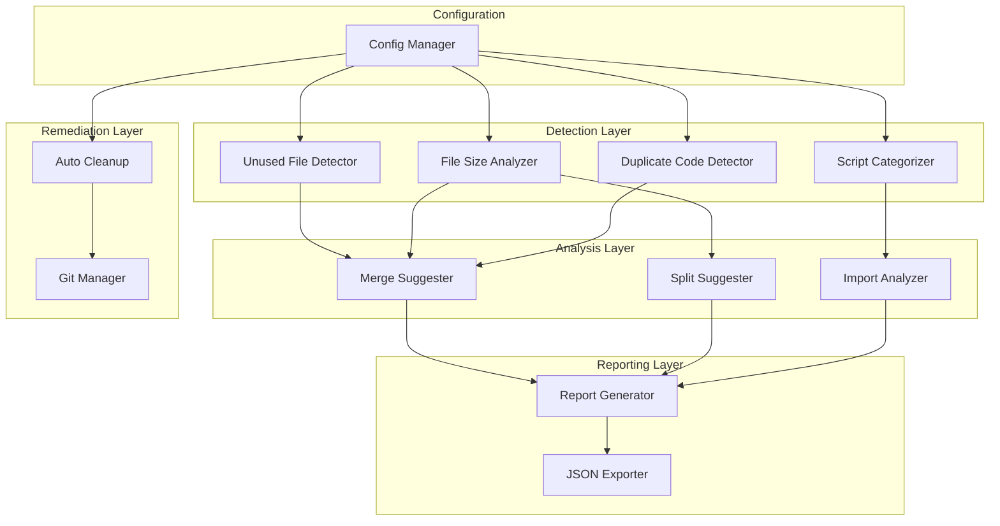
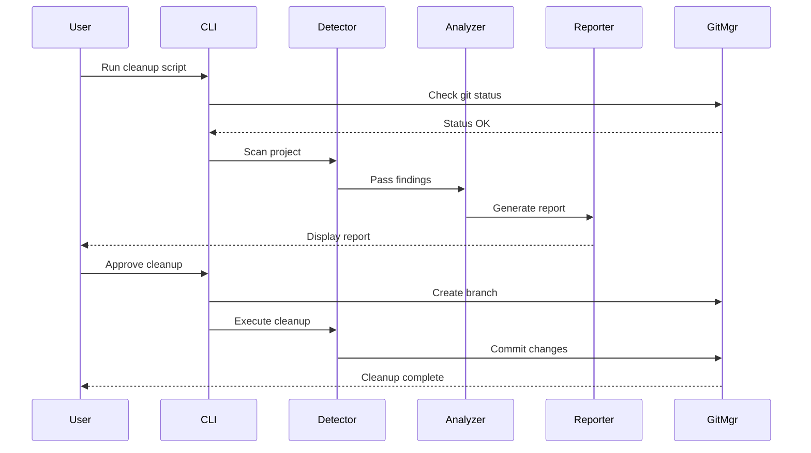

# Design Document: Post-Development Cleanup

## Overview

The Post-Development Cleanup system provides a comprehensive suite of automated tools to analyze, detect, and remediate code quality issues in the BIST30 AI Trader project. The system follows a detect-analyze-report-remediate workflow, with strong emphasis on safety through dry-run modes, git integration, and incremental changes.

The design implements eight maintenance scripts organized under `scripts/maintenance/`:
1. **find_unused_files.py** - Detects Python files not imported anywhere
2. **find_small_files.py** - Identifies files under 100 lines
3. **find_large_files.py** - Identifies files over 500 lines
4. **find_duplicate_code.py** - Detects duplicate function implementations
5. **organize_scripts.py** - Categorizes and reorganizes scripts by usage pattern
6. **suggest_merges.py** - Suggests merge opportunities for small files
7. **auto_cleanup.py** - Automated cleanup of temporary files and artifacts
8. **generate_cleanup_report.py** - Comprehensive cleanup report generator

## Architecture

### High-Level Architecture



### Component Interaction Flow



## Components and Interfaces

### 1. Configuration Manager

**Purpose**: Centralized configuration management for all cleanup tools.

**Interface**:
```python
class CleanupConfig:
    """Configuration for cleanup operations"""
    
    def __init__(self, config_path: Optional[str] = None):
        """Load configuration from YAML file or use defaults"""
        pass
    
    @property
    def small_file_threshold(self) -> int:
        """Threshold for small files (default: 100 lines)"""
        pass
    
    @property
    def large_file_threshold(self) -> int:
        """Threshold for large files (default: 500 lines)"""
        pass
    
    @property
    def log_retention_days(self) -> int:
        """Days to retain log files (default: 30)"""
        pass
    
    @property
    def excluded_dirs(self) -> List[str]:
        """Directories to exclude from analysis"""
        pass
    
    @property
    def excluded_patterns(self) -> List[str]:
        """File patterns to exclude"""
        pass
    
    def validate(self) -> Tuple[bool, List[str]]:
        """Validate configuration and return errors"""
        pass
```

**Configuration File Format** (cleanup_config.yaml):
```yaml
thresholds:
  small_file_lines: 100
  large_file_lines: 500
  log_retention_days: 30
  duplicate_similarity: 0.85

exclusions:
  directories:
    - .venv
    - __pycache__
    - .git
    - node_modules
    - .pytest_cache
  patterns:
    - "test_*.py"
    - "*_test.py"
    - "__init__.py"
    - "setup.py"

script_categories:
  production:
    - train_models.py
    - run_backtest.py
    - daily_run.py
    - paper_trading_runner.py
  
  analysis_keywords:
    - analyze
    - check
    - inspect
    - compare
    - evaluate
  
  maintenance_keywords:
    - migrate
    - update
    - fix
    - clean
    - convert
  
  test_keywords:
    - test
    - verify
    - validate
    - debug
```

### 2. File Scanner

**Purpose**: Core utility for scanning Python files and extracting metadata.

**Interface**:
```python
@dataclass
class FileInfo:
    """Metadata about a Python file"""
    path: Path
    lines: int
    blank_lines: int
    comment_lines: int
    code_lines: int
    imports: List[str]
    functions: List[str]
    classes: List[str]
    last_modified: datetime

class FileScanner:
    """Scans Python files and extracts metadata"""
    
    def __init__(self, config: CleanupConfig):
        self.config = config
    
    def scan_file(self, file_path: Path) -> FileInfo:
        """Scan a single Python file"""
        pass
    
    def scan_directory(self, root_path: Path) -> List[FileInfo]:
        """Recursively scan directory for Python files"""
        pass
    
    def count_lines(self, file_path: Path) -> Tuple[int, int, int]:
        """Count total, blank, and comment lines"""
        pass
    
    def extract_imports(self, file_path: Path) -> List[str]:
        """Extract all import statements"""
        pass
    
    def extract_definitions(self, file_path: Path) -> Tuple[List[str], List[str]]:
        """Extract function and class names"""
        pass
```

### 3. Unused File Detector

**Purpose**: Identifies Python files that are not imported anywhere in the project.

**Interface**:
```python
@dataclass
class UnusedFileResult:
    """Result of unused file detection"""
    unused_files: List[FileInfo]
    import_graph: Dict[str, List[str]]
    special_files: List[str]

class UnusedFileDetector:
    """Detects unused Python files"""
    
    def __init__(self, config: CleanupConfig, scanner: FileScanner):
        self.config = config
        self.scanner = scanner
    
    def build_import_graph(self, files: List[FileInfo]) -> Dict[str, List[str]]:
        """Build graph of file imports"""
        pass
    
    def find_unused_files(self, root_path: Path) -> UnusedFileResult:
        """Find all unused Python files"""
        pass
    
    def is_special_file(self, file_path: Path) -> bool:
        """Check if file is special (__init__, __main__, setup, etc.)"""
        pass
    
    def export_json(self, result: UnusedFileResult, output_path: Path):
        """Export results to JSON"""
        pass
```

**Algorithm**:
1. Scan all Python files in project
2. Build import graph (file → imported files)
3. Mark files as special if they match patterns (__init__.py, __main__.py, setup.py, top-level scripts)
4. For each non-special file, check if it appears in any import statement
5. Files not in import graph and not special are unused

### 4. File Size Analyzer

**Purpose**: Identifies files that are too small or too large based on configurable thresholds.

**Interface**:
```python
@dataclass
class FileSizeResult:
    """Result of file size analysis"""
    small_files: List[FileInfo]
    large_files: List[FileInfo]
    average_size: float
    median_size: float
    size_distribution: Dict[str, int]

class FileSizeAnalyzer:
    """Analyzes file sizes"""
    
    def __init__(self, config: CleanupConfig, scanner: FileScanner):
        self.config = config
        self.scanner = scanner
    
    def analyze_sizes(self, root_path: Path) -> FileSizeResult:
        """Analyze file sizes across project"""
        pass
    
    def group_by_directory(self, files: List[FileInfo]) -> Dict[str, List[FileInfo]]:
        """Group files by directory"""
        pass
    
    def suggest_split_points(self, file_info: FileInfo) -> List[int]:
        """Suggest logical split points for large files"""
        pass
    
    def export_json(self, result: FileSizeResult, output_path: Path):
        """Export results to JSON"""
        pass
```

### 5. Duplicate Code Detector

**Purpose**: Identifies duplicate or near-duplicate function implementations across files.

**Interface**:
```python
@dataclass
class DuplicateGroup:
    """Group of duplicate functions"""
    function_name: str
    locations: List[Tuple[Path, int]]  # (file_path, line_number)
    similarity: float
    code_snippet: str
    suggested_location: str

@dataclass
class DuplicateResult:
    """Result of duplicate detection"""
    duplicate_groups: List[DuplicateGroup]
    total_duplicates: int

class DuplicateCodeDetector:
    """Detects duplicate code"""
    
    def __init__(self, config: CleanupConfig, scanner: FileScanner):
        self.config = config
        self.scanner = scanner
    
    def extract_functions(self, file_path: Path) -> List[Tuple[str, str, int]]:
        """Extract function name, body, and line number"""
        pass
    
    def normalize_code(self, code: str) -> str:
        """Normalize whitespace and comments"""
        pass
    
    def calculate_similarity(self, code1: str, code2: str) -> float:
        """Calculate similarity between code blocks"""
        pass
    
    def find_duplicates(self, root_path: Path) -> DuplicateResult:
        """Find all duplicate code"""
        pass
    
    def suggest_shared_location(self, group: DuplicateGroup) -> str:
        """Suggest where to place shared utility"""
        pass
    
    def export_json(self, result: DuplicateResult, output_path: Path):
        """Export results to JSON"""
        pass
```

**Algorithm**:
1. Extract all functions from all Python files
2. Normalize each function body (remove whitespace, comments)
3. Compare each function with all others using similarity metric (e.g., difflib.SequenceMatcher)
4. Group functions with similarity > threshold (default 0.85)
5. For each group, suggest shared utility location based on usage patterns

### 6. Script Categorizer

**Purpose**: Categorizes scripts by usage pattern and proposes reorganization.

**Interface**:
```python
@dataclass
class ScriptCategory:
    """Script category information"""
    name: str
    scripts: List[Path]
    target_directory: str

@dataclass
class ScriptOrganizationResult:
    """Result of script organization analysis"""
    production: ScriptCategory
    analysis: ScriptCategory
    maintenance: ScriptCategory
    integration_tests: ScriptCategory
    reorganization_plan: List[Tuple[Path, Path]]  # (source, target)
    broken_imports: List[Tuple[Path, str]]  # (file, import_statement)

class ScriptCategorizer:
    """Categorizes and organizes scripts"""
    
    def __init__(self, config: CleanupConfig, scanner: FileScanner):
        self.config = config
        self.scanner = scanner
    
    def categorize_script(self, script_path: Path) -> str:
        """Categorize a single script"""
        pass
    
    def is_production_script(self, script_path: Path) -> bool:
        """Check if script is used in production"""
        pass
    
    def analyze_organization(self, scripts_dir: Path) -> ScriptOrganizationResult:
        """Analyze current organization and propose changes"""
        pass
    
    def detect_broken_imports(self, reorganization_plan: List[Tuple[Path, Path]]) -> List[Tuple[Path, str]]:
        """Detect imports that would break after reorganization"""
        pass
    
    def export_json(self, result: ScriptOrganizationResult, output_path: Path):
        """Export results to JSON"""
        pass
```

**Categorization Logic**:
1. **Production Scripts**: Referenced in shell scripts (.sh files), documentation, or explicitly listed in config
2. **Analysis Scripts**: Contains keywords (analyze, check, inspect, compare, evaluate) and not in production list
3. **Maintenance Scripts**: Contains keywords (migrate, update, fix, clean, convert) and not in production list
4. **Integration Test Scripts**: Contains keywords (test, verify, validate, debug) and located in scripts/ (not tests/)

### 7. Merge Suggester

**Purpose**: Suggests merge opportunities for small related files.

**Interface**:
```python
@dataclass
class MergeSuggestion:
    """Suggestion to merge files"""
    source_files: List[FileInfo]
    target_file: Path
    estimated_size: int
    functional_similarity: float
    required_import_updates: List[Tuple[Path, str, str]]  # (file, old_import, new_import)

@dataclass
class MergeResult:
    """Result of merge analysis"""
    suggestions: List[MergeSuggestion]
    total_file_reduction: int

class MergeSuggester:
    """Suggests file merges"""
    
    def __init__(self, config: CleanupConfig, scanner: FileScanner):
        self.config = config
        self.scanner = scanner
    
    def calculate_functional_similarity(self, files: List[FileInfo]) -> float:
        """Calculate functional similarity between files"""
        pass
    
    def suggest_merges(self, small_files: List[FileInfo]) -> MergeResult:
        """Suggest merge opportunities"""
        pass
    
    def estimate_merged_size(self, files: List[FileInfo]) -> int:
        """Estimate size of merged file"""
        pass
    
    def find_import_updates(self, suggestion: MergeSuggestion) -> List[Tuple[Path, str, str]]:
        """Find all imports that need updating"""
        pass
    
    def export_json(self, result: MergeResult, output_path: Path):
        """Export results to JSON"""
        pass
```

**Functional Similarity Calculation**:
1. Compare import patterns (shared imports indicate related functionality)
2. Analyze class hierarchies (inheritance relationships)
3. Check function naming conventions (similar prefixes/suffixes)
4. Calculate weighted score: 0.4 * import_similarity + 0.3 * hierarchy_similarity + 0.3 * naming_similarity

### 8. Auto Cleanup Manager

**Purpose**: Automated cleanup of temporary files and artifacts.

**Interface**:
```python
@dataclass
class CleanupOperation:
    """Single cleanup operation"""
    operation_type: str  # 'delete_file', 'delete_dir', 'remove_empty_init'
    target: Path
    reason: str
    size_bytes: int

@dataclass
class CleanupResult:
    """Result of cleanup operations"""
    operations: List[CleanupOperation]
    total_size_freed: int
    dry_run: bool

class AutoCleanupManager:
    """Manages automated cleanup"""
    
    def __init__(self, config: CleanupConfig):
        self.config = config
    
    def find_pycache_dirs(self, root_path: Path) -> List[Path]:
        """Find all __pycache__ directories"""
        pass
    
    def find_old_logs(self, root_path: Path) -> List[Path]:
        """Find log files older than retention period"""
        pass
    
    def find_empty_inits(self, root_path: Path) -> List[Path]:
        """Find empty __init__.py files"""
        pass
    
    def find_temp_files(self, root_path: Path) -> List[Path]:
        """Find temporary files matching patterns"""
        pass
    
    def execute_cleanup(self, root_path: Path, dry_run: bool = True) -> CleanupResult:
        """Execute cleanup operations"""
        pass
    
    def log_operation(self, operation: CleanupOperation):
        """Log cleanup operation"""
        pass
    
    def export_json(self, result: CleanupResult, output_path: Path):
        """Export results to JSON"""
        pass
```

### 9. Git Manager

**Purpose**: Manages git operations for safe cleanup.

**Interface**:
```python
class GitManager:
    """Manages git operations"""
    
    def __init__(self, repo_path: Path):
        self.repo_path = repo_path
    
    def check_git_status(self) -> Tuple[bool, str]:
        """Check if repo is clean (no uncommitted changes)"""
        pass
    
    def create_cleanup_branch(self) -> str:
        """Create timestamped cleanup branch"""
        pass
    
    def commit_changes(self, message: str):
        """Commit current changes"""
        pass
    
    def rollback(self, original_branch: str):
        """Rollback to original branch and delete cleanup branch"""
        pass
    
    def get_current_branch(self) -> str:
        """Get current branch name"""
        pass
```

### 10. Report Generator

**Purpose**: Generates comprehensive cleanup reports in multiple formats.

**Interface**:
```python
@dataclass
class CleanupReport:
    """Comprehensive cleanup report"""
    timestamp: datetime
    total_files: int
    average_file_size: float
    unused_files: UnusedFileResult
    file_sizes: FileSizeResult
    duplicates: DuplicateResult
    script_organization: ScriptOrganizationResult
    merge_suggestions: MergeResult
    estimated_improvements: Dict[str, Any]
    prioritized_actions: List[Tuple[str, int, int]]  # (action, impact, effort)

class ReportGenerator:
    """Generates cleanup reports"""
    
    def __init__(self, config: CleanupConfig):
        self.config = config
    
    def generate_report(self, 
                       unused: UnusedFileResult,
                       sizes: FileSizeResult,
                       duplicates: DuplicateResult,
                       scripts: ScriptOrganizationResult,
                       merges: MergeResult) -> CleanupReport:
        """Generate comprehensive report"""
        pass
    
    def calculate_improvements(self, report: CleanupReport) -> Dict[str, Any]:
        """Calculate estimated improvements"""
        pass
    
    def prioritize_actions(self, report: CleanupReport) -> List[Tuple[str, int, int]]:
        """Prioritize actions by impact and effort"""
        pass
    
    def export_markdown(self, report: CleanupReport, output_path: Path):
        """Export report as Markdown"""
        pass
    
    def export_json(self, report: CleanupReport, output_path: Path):
        """Export report as JSON"""
        pass
    
    def translate_to_turkish(self, report: CleanupReport) -> CleanupReport:
        """Translate report sections to Turkish"""
        pass
```

**Improvement Calculations**:
- **File Count Reduction**: (unused_files + merged_files) / total_files * 100
- **Average File Size Increase**: (sum of merged file sizes / number of merges) / current_average * 100
- **Maintainability Score**: Weighted formula based on:
  - File count reduction (30%)
  - Duplicate elimination (30%)
  - File size normalization (20%)
  - Script organization (20%)

## Data Models

### FileInfo
```python
@dataclass
class FileInfo:
    path: Path
    lines: int
    blank_lines: int
    comment_lines: int
    code_lines: int
    imports: List[str]
    functions: List[str]
    classes: List[str]
    last_modified: datetime
```

### Configuration Schema
```yaml
thresholds:
  small_file_lines: int
  large_file_lines: int
  log_retention_days: int
  duplicate_similarity: float

exclusions:
  directories: List[str]
  patterns: List[str]

script_categories:
  production: List[str]
  analysis_keywords: List[str]
  maintenance_keywords: List[str]
  test_keywords: List[str]
```

### Report Output Schema (JSON)
```json
{
  "timestamp": "2024-01-15T10:30:00Z",
  "summary": {
    "total_files": 110,
    "average_file_size": 150,
    "unused_files_count": 15,
    "small_files_count": 25,
    "large_files_count": 8,
    "duplicate_groups": 10
  },
  "unused_files": [...],
  "file_sizes": {...},
  "duplicates": {...},
  "script_organization": {...},
  "merge_suggestions": {...},
  "estimated_improvements": {
    "file_count_reduction": 27,
    "avg_file_size_increase": 67,
    "maintainability_improvement": 50
  },
  "prioritized_actions": [...]
}
```


## Correctness Properties

A property is a characteristic or behavior that should hold true across all valid executions of a system—essentially, a formal statement about what the system should do. Properties serve as the bridge between human-readable specifications and machine-verifiable correctness guarantees.

### Property 1: Import Graph Completeness

*For any* Python project structure, when the unused file detector builds an import graph, all files that are imported (via import or from...import statements) should be marked as used, and all files not in the import graph (excluding special files) should be marked as unused.

**Validates: Requirements 1.1, 1.2, 1.3**

### Property 2: Special File Exclusion

*For any* file list containing special files (__init__.py, __main__.py, setup.py, top-level scripts), the unused file detector should exclude these files from the unused files list regardless of whether they are imported.

**Validates: Requirements 1.3**

### Property 3: File Size Classification Correctness

*For any* Python file, the file size analyzer should classify it as Small_File if code_lines < 100, Large_File if code_lines > 500, and neither if 100 <= code_lines <= 500, where code_lines excludes blank lines and comments.

**Validates: Requirements 2.1, 2.2, 2.3**

### Property 4: Line Counting Accuracy

*For any* Python file, the line counter should count only non-blank, non-comment lines as code lines, such that total_lines = code_lines + blank_lines + comment_lines.

**Validates: Requirements 2.1**

### Property 5: Average File Size Calculation

*For any* set of Python files, the calculated average file size should equal the sum of all file sizes divided by the number of files.

**Validates: Requirements 2.6**

### Property 6: Duplicate Detection with Normalization

*For any* two functions that are identical except for whitespace and comments, the duplicate detector should identify them as duplicates with similarity >= threshold after normalization.

**Validates: Requirements 3.1, 3.2**

### Property 7: Duplicate Grouping Completeness

*For any* set of duplicate functions across multiple files, the duplicate detector should group all instances together and report all file locations in the same duplicate group.

**Validates: Requirements 3.3**

### Property 8: Similarity Calculation Consistency

*For any* pair of code blocks, the similarity calculator should return a value between 0.0 and 1.0, where 1.0 indicates identical code and 0.0 indicates completely different code.

**Validates: Requirements 3.4**

### Property 9: Script Categorization Correctness

*For any* script file, the categorizer should assign exactly one category (Production, Analysis, Maintenance, or Integration_Test) based on the categorization rules, with production scripts taking precedence.

**Validates: Requirements 4.1, 4.2, 4.3, 4.4**

### Property 10: Production Script Preservation

*For any* reorganization plan, all scripts categorized as Production_Scripts should remain at the scripts/ root level and not be moved to subdirectories.

**Validates: Requirements 4.6**

### Property 11: Broken Import Detection

*For any* reorganization plan that moves scripts, the import analyzer should detect all import statements that would break due to the path changes.

**Validates: Requirements 4.7**

### Property 12: Merge Candidate Size Constraint

*For any* merge suggestion, all source files should be Small_Files (< 100 lines) and the estimated merged file size should be <= 500 lines.

**Validates: Requirements 5.1, 5.4**

### Property 13: Functional Similarity Calculation

*For any* set of files being evaluated for merging, the functional similarity score should be calculated using import patterns, class hierarchies, and function naming conventions with appropriate weights.

**Validates: Requirements 5.3**

### Property 14: Cleanup Operation Completeness

*For any* project directory, the auto cleanup should identify and remove (or report in dry-run) all __pycache__ directories, .pyc files, old log files (> retention days), empty __init__.py files in empty directories, and temporary files matching configured patterns.

**Validates: Requirements 6.1, 6.2, 6.3, 6.4**

### Property 15: Dry-Run Safety

*For any* cleanup operation executed in dry-run mode, no files should be actually deleted, but all operations should be reported as if they would be executed.

**Validates: Requirements 6.5**

### Property 16: Cleanup Operation Logging

*For any* cleanup operation (whether dry-run or actual), all operations should be logged with timestamps and file paths.

**Validates: Requirements 6.7**

### Property 17: Report Completeness

*For any* cleanup report, it should include all required sections: summary statistics (total files, average size), unused files list, small/large files lists, duplicate groups, script organization plan, merge suggestions, estimated improvements, and prioritized actions.

**Validates: Requirements 7.1, 7.2, 7.3, 7.4, 7.5, 7.7**

### Property 18: Improvement Calculation Accuracy

*For any* cleanup report, the estimated improvements should be calculated correctly: file_count_reduction = (unused + merged) / total * 100, avg_size_increase based on merge estimates, and maintainability score based on weighted formula.

**Validates: Requirements 7.6**

### Property 19: Dual Format Output Consistency

*For any* report or result, when output in both formats (Markdown/JSON or Console/JSON), both formats should contain the same data with equivalent structure.

**Validates: Requirements 1.5, 7.8**

### Property 20: Git Safety Check

*For any* destructive operation, the git manager should verify that a git repository exists and has no uncommitted changes before proceeding, and should refuse to proceed if uncommitted changes exist.

**Validates: Requirements 8.1, 8.2**

### Property 21: Cleanup Branch Creation

*For any* cleanup operation, a new git branch should be created with the naming pattern "cleanup-YYYYMMDD-HHMMSS" where the timestamp matches the operation start time.

**Validates: Requirements 8.3**

### Property 22: Incremental Commit Behavior

*For any* sequence of file operations during cleanup, each logical group of changes should result in a separate git commit with a descriptive message.

**Validates: Requirements 8.4**

### Property 23: Rollback Completeness

*For any* cleanup operation that is rolled back, the repository should return to the original branch state and the cleanup branch should be deleted.

**Validates: Requirements 8.5**

### Property 24: Configuration Loading with Defaults

*For any* cleanup system initialization, if a configuration file exists and is valid, it should be loaded; if missing or invalid, default values should be used (small_file_threshold=100, large_file_threshold=500, log_retention_days=30).

**Validates: Requirements 10.1, 10.2, 10.6**

### Property 25: Configuration Customization

*For any* valid configuration file, all specified thresholds, exclusions, and patterns should override the default values and be used throughout the cleanup process.

**Validates: Requirements 10.3, 10.4, 10.5**

### Property 26: Exclusion Pattern Respect

*For any* file or directory matching an exclusion pattern in the configuration, it should be excluded from all analysis and cleanup operations.

**Validates: Requirements 10.4, 10.5**

## Error Handling

### Error Categories

1. **Configuration Errors**
   - Invalid YAML syntax
   - Invalid threshold values (negative, zero, or non-numeric)
   - Missing required configuration sections
   - **Handling**: Log validation errors, use default values, continue execution

2. **File System Errors**
   - Permission denied when reading files
   - File not found during analysis
   - Disk full during cleanup
   - **Handling**: Log error, skip problematic file, continue with remaining files

3. **Git Errors**
   - No git repository found
   - Uncommitted changes detected
   - Branch creation failure
   - Commit failure
   - **Handling**: Halt destructive operations, provide clear error message and recovery instructions

4. **Import Analysis Errors**
   - Syntax errors in Python files
   - Circular imports
   - Invalid import statements
   - **Handling**: Log warning, mark file as unparseable, continue analysis

5. **Duplicate Detection Errors**
   - Function extraction failure
   - Similarity calculation overflow
   - **Handling**: Log warning, skip problematic function, continue analysis

### Error Recovery Strategies

1. **Graceful Degradation**: If one analysis component fails, others continue
2. **Partial Results**: Report what was successfully analyzed even if some parts failed
3. **Detailed Logging**: All errors logged with context (file path, operation, timestamp)
4. **User Guidance**: Clear error messages with suggested actions
5. **Rollback Support**: Git-based rollback for any destructive operations

### Error Reporting Format

```python
@dataclass
class CleanupError:
    timestamp: datetime
    error_type: str
    component: str
    file_path: Optional[Path]
    message: str
    recovery_action: str
```

## Testing Strategy

### Dual Testing Approach

The cleanup system requires both unit tests and property-based tests for comprehensive coverage:

- **Unit tests**: Verify specific examples, edge cases, and error conditions
- **Property tests**: Verify universal properties across all inputs

### Unit Testing Focus

Unit tests should focus on:
- Specific examples demonstrating correct behavior (e.g., detecting a known unused file)
- Edge cases (empty files, files with only comments, circular imports)
- Error conditions (invalid config, permission errors, git errors)
- Integration points between components (scanner → detector, detector → reporter)

### Property-Based Testing Configuration

- **Library**: Use `hypothesis` for Python property-based testing
- **Iterations**: Minimum 100 iterations per property test
- **Tagging**: Each property test must reference its design document property
- **Tag format**: `# Feature: post-development-cleanup, Property {number}: {property_text}`

### Test Coverage by Component

1. **Configuration Manager**
   - Unit: Test default values, valid config loading, invalid config handling
   - Property: Configuration round-trip (load → use → verify)

2. **File Scanner**
   - Unit: Test specific file structures, empty files, syntax errors
   - Property: Line counting accuracy, import extraction completeness

3. **Unused File Detector**
   - Unit: Test simple import chains, circular imports
   - Property: Import graph completeness, special file exclusion

4. **File Size Analyzer**
   - Unit: Test boundary cases (99, 100, 500, 501 lines)
   - Property: Classification correctness, average calculation

5. **Duplicate Code Detector**
   - Unit: Test identical functions, near-identical functions, different functions
   - Property: Normalization correctness, grouping completeness

6. **Script Categorizer**
   - Unit: Test known production scripts, analysis scripts
   - Property: Categorization correctness, production preservation

7. **Merge Suggester**
   - Unit: Test specific merge scenarios
   - Property: Size constraints, similarity calculation

8. **Auto Cleanup Manager**
   - Unit: Test specific cleanup operations
   - Property: Cleanup completeness, dry-run safety

9. **Git Manager**
   - Unit: Test branch creation, commits, rollback
   - Property: Safety checks, rollback completeness

10. **Report Generator**
    - Unit: Test report sections, formatting
    - Property: Report completeness, dual format consistency

### Integration Testing

Integration tests should verify:
- End-to-end workflow: scan → analyze → report → cleanup
- Cross-component data flow: FileInfo → Analysis Results → Report
- Git integration: branch creation → commits → rollback
- Configuration propagation: config → all components

### Test Data Generation

For property-based tests, generate:
- **Random project structures**: Varying numbers of files, directories, import patterns
- **Random file contents**: Varying line counts, import statements, function definitions
- **Random configurations**: Varying thresholds, exclusions, patterns
- **Random git states**: Clean, dirty, no repo, various branches

### Example Property Test

```python
from hypothesis import given, strategies as st
import hypothesis

@given(
    files=st.lists(
        st.tuples(
            st.text(min_size=1, max_size=50),  # filename
            st.integers(min_value=0, max_value=1000)  # line count
        ),
        min_size=1,
        max_size=100
    )
)
def test_average_file_size_calculation(files):
    """
    Feature: post-development-cleanup, Property 5: Average File Size Calculation
    
    For any set of Python files, the calculated average file size should equal
    the sum of all file sizes divided by the number of files.
    """
    # Create temporary files with specified line counts
    file_infos = create_test_files(files)
    
    # Calculate average using the system
    analyzer = FileSizeAnalyzer(config, scanner)
    result = analyzer.analyze_sizes(test_dir)
    
    # Calculate expected average
    expected_avg = sum(f.code_lines for f in file_infos) / len(file_infos)
    
    # Verify
    assert abs(result.average_size - expected_avg) < 0.01
```

### Test Execution

- Run unit tests with pytest: `pytest tests/`
- Run property tests with hypothesis: `pytest tests/ -m property`
- Run integration tests: `pytest tests/integration/`
- Generate coverage report: `pytest --cov=scripts/maintenance --cov-report=html`

### Continuous Integration

- All tests must pass before merging
- Property tests run with 100 iterations in CI
- Integration tests run on multiple Python versions (3.9, 3.10, 3.11, 3.12)
- Coverage threshold: 85% for maintenance scripts
